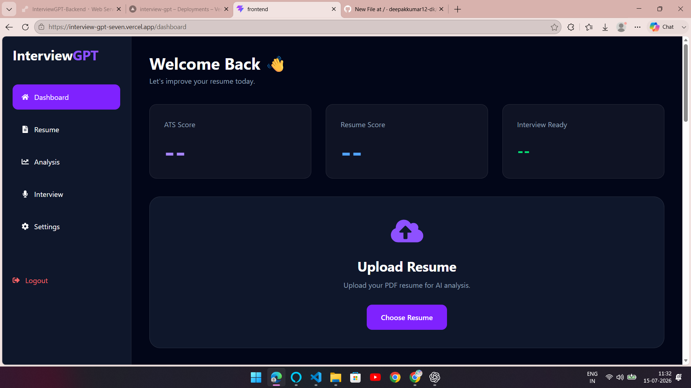
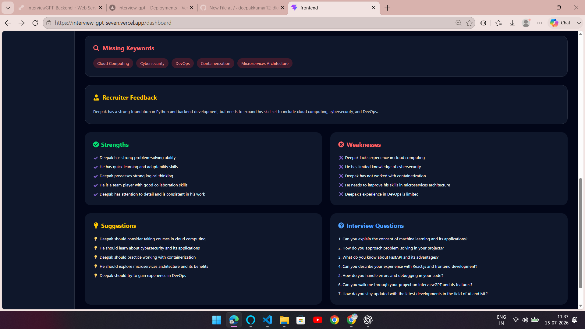
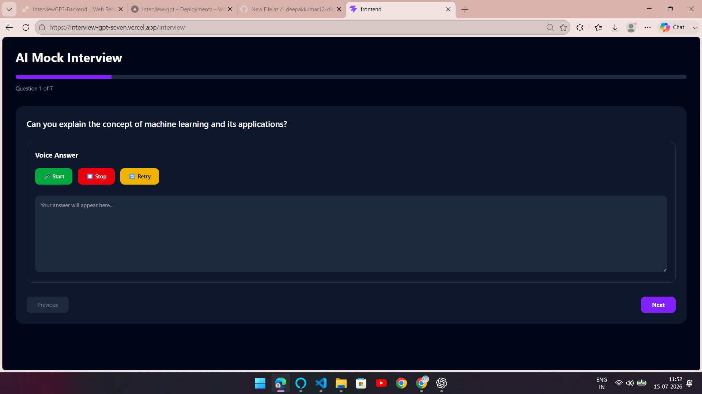
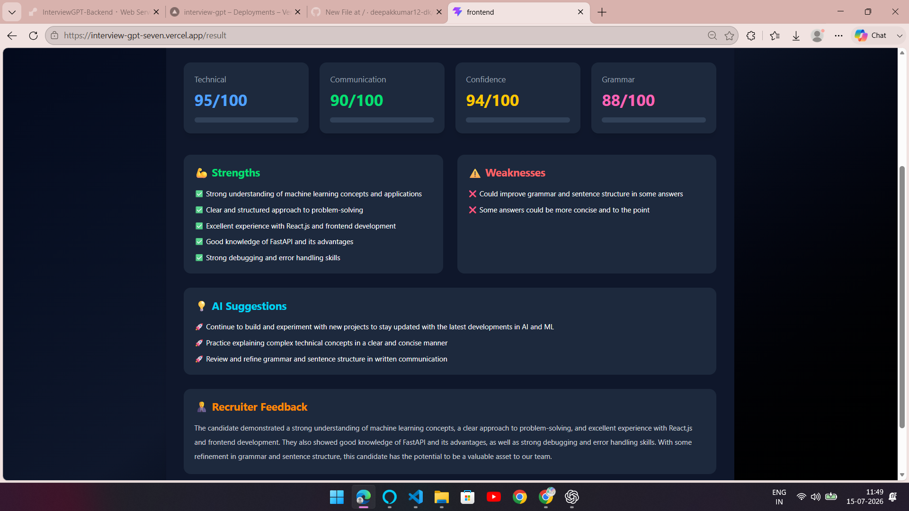

# 🚀 InterviewGPT

An AI-powered Resume Analyzer and Mock Interview Platform that helps candidates improve their resumes and interview performance using AI.

## 🌐 Live Demo

🔗 **Frontend:** https://interview-gpt-seven.vercel.app

🔗 **Backend API:** https://interviewgpt-backend-bunj.onrender.com

---

## 📸 Screenshots

### Home


### Resume Analysis


### AI Interview


### Interview Result


---

## ✨ Features

- 📄 Resume Analysis
- 📊 ATS Score
- 🤖 AI Resume Feedback
- 💡 Personalized Interview Questions
- 🎤 Voice-Based Mock Interview
- 📈 AI Interview Evaluation
- 🔄 AI Follow-up Questions
- 📱 Responsive UI

---

## 🛠 Tech Stack

**Frontend**
- React.js
- Vite
- Tailwind CSS
- Axios

**Backend**
- FastAPI
- Python
- Groq API
- Gemini API
- PyPDF

**Deployment**
- Vercel
- Render

---

## 🚀 Run Locally

### Frontend

```bash
cd frontend
npm install
npm run dev
```

### Backend

```bash
cd backend
pip install -r requirements.txt
uvicorn main:app --reload
```

Create a `.env` file inside the backend folder:

```env
GEMINI_API_KEY=your_key
GROQ_API_KEY=your_key
```

---

## 📂 Project Structure

```
InterviewGPT
├── frontend
├── backend
├── screenshots
└── README.md
```

---

## 👨‍💻 Developer

**Deepak Kumar**

🐍 Python Developer | 🤖 AI/ML Developer

- GitHub: https://github.com/deepakkumar12-dk
- LinkedIn: https://www.linkedin.com/in/deepak-kumar-643734285/

---

⭐ If you found this project helpful, consider giving it a star on GitHub!
